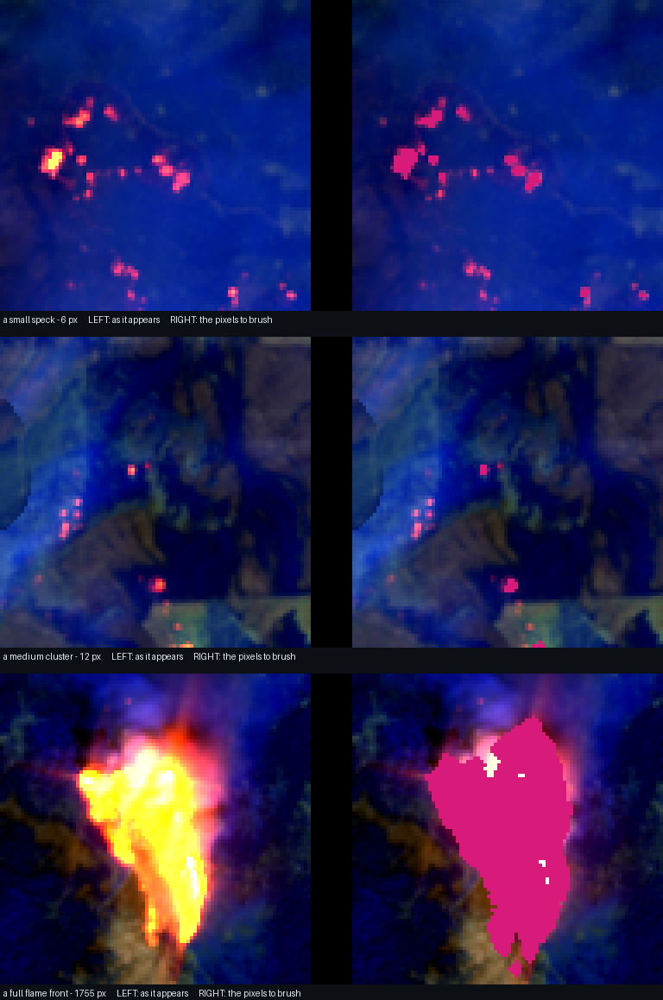

# Hand-labelling batch - four held-out fires

432 chips from the test split (CALDWELL, Hopkins, Slater, Windy), at 1024x1024 px
(2x nearest-neighbour upscale of the distributed 512 px chips).

## What you are deciding

These are Sentinel-2 false-colour composites: **R = B12 (SWIR2), G = B11 (SWIR1),
B = B8A (NIR)**. In this rendering:

| Appearance | What it is | Label it? |
|---|---|---|
| Saturated orange / yellow / white **core**, small and sharp-edged | Active flame | **YES** - `active_fire` |
| Brown, olive, or near-black, matte, often large | Fresh burn scar | No |
| Diffuse white or grey, soft-edged, drifting, casts no hard shadow | Smoke | No |
| Bright white, textured, with a dark shadow offset | Cloud | No |
| Uniform tan or pale grey, follows terrain | Bare rock, dry soil | No |
| Bright spot on water or a roof, bright in *every* channel | Specular glint | No |
| Pure black at a straight frame edge | Outside the acquisition footprint | No - leave blank |

`what_to_look_for.png` shows the three scales you will meet, at 4x, with the
pixels to brush on the right. It is built from **training** chips, not from
anything in `images/`, so it calibrates the class without showing you an answer.
Note the largest example: the label covers the saturated core, not the red glow
bleeding around it.

The single discriminator is that **flame emits** at 2.2 um rather than reflecting
it. Emission drives the red channel far past anything a passive surface can
reach, so flame reads as an orange-to-white core that is much brighter in red
than in blue. Fresh char is also dark in NIR and brightish in SWIR2 -- that is
the one confusion worth being careful about -- but char is dull and spatially
broad, while flame is intense and concentrated.

**When you genuinely cannot tell, use `uncertain`.** Obscured by cloud, too faint
to call, ambiguous against bright rock. Those pixels are excluded from scoring
rather than forced into a guess, which is far better than a coin flip -- a forced
guess is indistinguishable from a real judgement once it is in the file.

## How to work

1. Create a Label Studio project, paste `labeling_config.xml` into
   *Settings -> Labeling interface -> Code*.
2. Import everything in `images/`.
3. **Sort tasks by filename** and work top to bottom. The numeric prefix is a
   stratified random order, so stopping at any point still leaves an unbiased
   sample. Do not skip around, and do not label the easy ones first -- that is
   what breaks the sample.
4. Zoom in hard. Most targets are a few pixels; at 1:1 you will miss them.
   Brightness and contrast controls are enabled in the config and are safe to
   use freely -- they change what you can see, not what the pixels are.
5. Use a small brush. Err toward the visible core rather than its glow.

## How far to go

| After | Chips | Gives you |
|---|---|---|
| Batch 1 | 60 | A usable first estimate; enough to see whether the detector is systematically off |
| Batch 2 | 120 | Tight enough to quote in the paper |
| All | 432 | The full test split; no sampling caveat at all |

Roughly 60% of chips contain nothing and take seconds.

## When you are done

Export **twice**, into the same folder:

1. **Brush labels to PNG** -- unzip it.
2. **JSON** -- drop the `.json` next to the unzipped PNGs.

Both are needed. The PNGs hold the strokes (the JSON stores them as Label
Studio's own RLE, which the importer does not decode). The JSON holds two things
the PNGs cannot: which chips you judged *empty* -- those produce no PNG at all,
yet "I looked and there is nothing here" is exactly what catches a detector false
positive -- and which class each stroke was, so `uncertain` is not read as fire.

    python ../import_labels.py --export path/to/that/folder --batch .

That maps masks back to 512 px, writes them to `hand_masks/`, and reports
agreement between your labels and the detector's, per fire and overall.

## Do not open yet

`_scoring/manifest.csv` records which chip is which, **including the detector's
fire-pixel count**. Reading it before you label would anchor you to the answer.
`../import_labels.py` needs it; you do not.
